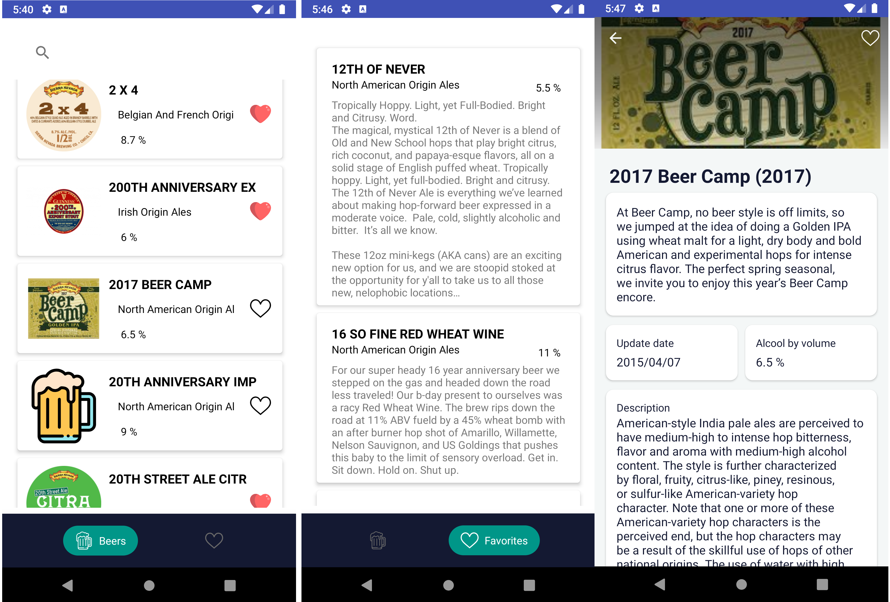

# 🍺 Libeery 🍺

Master1 E-Services - binôme : Genart Valentin - Fernandes Nicolas

Voici le dépôt du Projet final de TAC.

Libeery est une application Android qui permet de decouvrir des bières et de les garder en favoris. Elle implémente une architecture MVVM et le pattern repository.
On utilise retrofit pour requeter l'API et room DB pour les données en local.

## API utilisée :
[BreweryDB](https://www.brewerydb.com/developers/docs/endpoint/beer-index)

## Librairies utilisées :
- [Retrofit2](https://square.github.io/retrofit/)
- [Room](https://developer.android.com/training/data-storage/room)
- [Chipnavigation](https://github.com/ismaeldivita/chip-navigation-bar)
- [Picasso](https://square.github.io/picasso/)
---
## Quelques captures :

---

## Fonctionnement Git

### Les branches

Pour développer effectuer un changement, il faut créer une nouvelle branche à partir de *dev*, la nommer selon le format suivant : `<type>/<definition>` où `<type>` est
le contexte du changement, et où `<définition>` est la définition du changement.

*Exemple de types (liste non exhaustive)*
| refactor | feat | dep | fix | release | docs |
| --- | --- | --- | --- | --- | --- |
| Refactorisation de code | Nouvelle fonctionnalité développé | Mise à jour, ajout ou suppression d'une dépendance *(géré par depandabot)* | Correction d'une **issue** | Mise en test d'une nouvelle version de l'API | Ajout de documentation

### Les pull requests

Une fois votre changement effectué, et votre branche créé, il suffit de créer une pull request demandant de *merge* votre branche sur la branche `dev`. 

    dev <- votre/branche
    
Après le code review, vous pouvez **Squash and merge** votre *PR*, en résolvant les éventuels *conflicts*. 
N'oubliez pas de supprimer la branche qui a été merge si vous en avez plus besoin.
  
### Les issues

Si vous faites face à un problème quelconque lié à Git, au code, ou à une fonctionnalité, il faut créer une *issue* dans la catégorie du même nom. Vous pouvez
ajouter un label correspondant à votre problème (dépendances, fonctionnalité ...). 
Ainsi, vous pourrez lié une *PR* à cette *issue* pour indiquer la résolution du problème.
